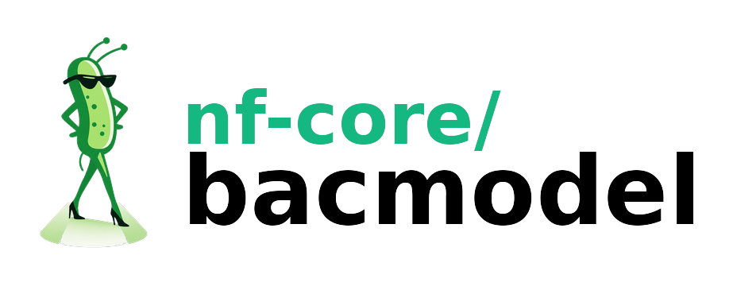
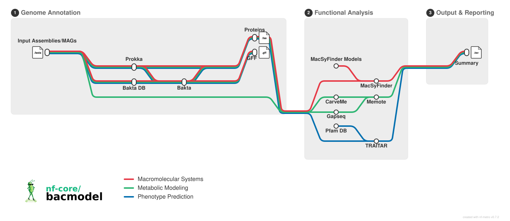

<h1>
  
</h1>

[](https://github.com/codespaces/new/nf-core/bacmodel)
[](https://github.com/nf-core/bacmodel/actions/workflows/nf-test.yml)
[](https://github.com/nf-core/bacmodel/actions/workflows/linting.yml)[](https://nf-co.re/bacmodel/results)[](https://doi.org/10.5281/zenodo.XXXXXXX)
[](https://www.nf-test.com)

[](https://www.nextflow.io/)
[](https://github.com/nf-core/tools/releases/tag/4.0.3)
[](https://docs.conda.io/en/latest/)
[](https://www.docker.com/)
[](https://sylabs.io/docs/)
[](https://cloud.seqera.io/launch?pipeline=https://github.com/nf-core/bacmodel)

[](https://nfcore.slack.com/channels/bacmodel)[](https://bsky.app/profile/nf-co.re)[](https://mstdn.science/@nf_core)[](https://www.youtube.com/c/nf-core)

## Introduction

**nf-core/bacmodel** is a bioinformatics pipeline for comprehensive functional annotation and metabolic modeling of bacterial genomes. The pipeline takes bacterial genome assemblies (FASTA format) and performs structural annotation using Prokka or Bakta, followed by functional characterization using specialized tools for macromolecular system detection (MacSyFinder), phenotype prediction (Traitar), and metabolic model reconstruction (CarveMe and gapseq). It produces a complete picture of genomic potential, functional capabilities, and predicted metabolic pathways.



The pipeline is built using [Nextflow](https://www.nextflow.io), a workflow tool to run tasks across multiple compute infrastructures in a very portable manner. It uses Docker/Singularity containers making installation trivial and results highly reproducible. The [Nextflow DSL2](https://www.nextflow.io/docs/latest/dsl2.html) implementation of this pipeline uses one container per process which makes it much easier to maintain and update software dependencies. Where possible, these processes have been submitted to and installed from [nf-core/modules](https://github.com/nf-core/modules) in order to make them available to all nf-core pipelines, and to everyone within the Nextflow community!

1. Genome annotation with [Prokka](https://github.com/tseemann/prokka) or [Bakta](https://github.com/oschwengers/bakta)
2. Macromolecular system detection with [MacSyFinder](https://github.com/gem-pasteur/macsyfinder) (optional)
3. Phenotype prediction with [Traitar](https://github.com/hzi-bifo/traitar) (optional)
4. Metabolic model reconstruction with [CarveMe](https://github.com/cdanielmachado/carveme) or [gapseq](https://github.com/jotech/gapseq) (optional)
5. Model quality evaluation with [MEMOTE](https://github.com/opencobra/memote) (optional)

## Usage

> [!NOTE]
> If you are new to Nextflow and nf-core, please refer to [this page](https://nf-co.re/docs/get_started/environment_setup/overview) on how to set-up Nextflow. Make sure to [test your setup](https://nf-co.re/docs/get_started/run-your-first-pipeline) with `-profile test` before running the workflow on actual data.

First, prepare a samplesheet with your input data that looks as follows. It can be comma-separated (`.csv`) or tab-separated (`.tsv`):

`samplesheet.csv`:

```csv
sample,fasta
sample1,/path/to/genome1.fasta
sample2,/path/to/genome2.fasta.gz
sample3,https://example.com/genome3.fasta.gz
```

Each row represents a bacterial genome assembly. The `fasta` column can contain:

- Local file paths (absolute or relative)
- URLs to remote FASTA files
- the files can be in gzipped or in uncompressed FASTA format

Now, you can run the pipeline using:

```bash
nextflow run nf-core/bacmodel \
   -profile <docker/singularity/.../institute> \
   --input samplesheet.csv \
   --outdir <OUTDIR>
```

By default, the pipeline runs Prokka annotation. To use Bakta instead:

```bash
nextflow run nf-core/bacmodel \
   -profile <docker/singularity/.../institute> \
   --input samplesheet.csv \
   --annotation_tool bakta \
   --outdir <OUTDIR>
```

To enable optional functional analysis tools:

```bash
nextflow run nf-core/bacmodel \
   -profile <docker/singularity/.../institute> \
   --input samplesheet.csv \
   --skip_macsyfinder false \
   --skip_traitar false \
   --skip_carveme false \
   --skip_gapseq false \
   --skip_memote false \
   --outdir <OUTDIR>
```

> [!WARNING]
> Please provide pipeline parameters via the CLI or Nextflow `-params-file` option. Custom config files including those provided by the `-c` Nextflow option can be used to provide any configuration _**except for parameters**_; see [docs](https://nf-co.re/docs/running/run-pipelines#using-parameter-files).

For more details and further functionality, please refer to the [usage documentation](https://nf-co.re/bacmodel/usage) and the [parameter documentation](https://nf-co.re/bacmodel/parameters).

## Pipeline output

To see the results of an example test run with a full size dataset refer to the [results](https://nf-co.re/bacmodel/results) tab on the nf-core website pipeline page.
For more details about the output files and reports, please refer to the
[output documentation](https://nf-co.re/bacmodel/output).

## Credits

nf-core/bacmodel was originally written by Olga Brovkina at the Institute of Clinical Molecular Biology (IKMB), Kiel University.

We thank the following people for their extensive assistance in the development of this pipeline:

- The nf-core community for providing excellent tools and modules
- The developers of Prokka, Bakta, MacSyFinder, Traitar, and CarveMe for their excellent software

## Contributions and Support

If you would like to contribute to this pipeline, please see the [contributing guidelines](docs/CONTRIBUTING.md).

For further information or help, don't hesitate to get in touch on the [Slack `#bacmodel` channel](https://nfcore.slack.com/channels/bacmodel) (you can join with [this invite](https://nf-co.re/join/slack)).

## Citations

<!-- TODO nf-core: Add citation for pipeline after first release. Uncomment lines below and update Zenodo doi and badge at the top of this file. -->
<!-- If you use nf-core/bacmodel for your analysis, please cite it using the following doi: [10.5281/zenodo.XXXXXX](https://doi.org/10.5281/zenodo.XXXXXX) -->

If you use nf-core/bacmodel for your analysis, please cite the pipeline along with the tools it uses. A full list of references for the tools and data used by the pipeline can be found in the [`CITATIONS.md`](CITATIONS.md) file.

You can cite the `nf-core` publication as follows:

> **The nf-core framework for community-curated bioinformatics pipelines.**
>
> Philip Ewels, Alexander Peltzer, Sven Fillinger, Harshil Patel, Johannes Alneberg, Andreas Wilm, Maxime Ulysse Garcia, Paolo Di Tommaso & Sven Nahnsen.
>
> _Nat Biotechnol._ 2020 Feb 13. doi: [10.1038/s41587-020-0439-x](https://dx.doi.org/10.1038/s41587-020-0439-x).
